# NEJLEPŠÍ ČEŠTÍ YOUTUBEŘI 2024

## Obsah

- [Intention](#intention)
  - [Goal](#goal)
  - [Solution Idea](#solution-idea)
- [Data origin](#data-origin)
- [Project Steps](#project-steps)
- [Dashboard Design](#dashboard-design)
  - [Required Dashboard Elements](#required-dashboard-elements)
  - [Dashboard Visualization](#dashboard-visualization)
  - [Tools requirements](#tools-requirements)
- [Project building](#project-building)
  - [General Workflow](#general-workflow)
  - [Data exploration](#data-exploration)
- [Data cleaning and testing](#data-cleaning-and-testing)
  - [Data cleaning and preparation](#data-cleaning-and-preparation)
  - [Data testing](#data-testing)
- [Visualization](#visualization)
  - [Data Visualization](#data-visualization)
  - [Measures](#measures)
- [Analysis](#analysis)
  - [Results overview](#results-overview)
  - [Validation - Scenarios ](#validation---scenarios )
- [Conclusion](#conclusion)
  - [Findings](#findings)
  - [Recommendations](#recommendations)

## Účel projektu

### Cíl
Marketingové oddělení chce identifikovat a analyzovat nejlepší youTubery v České republice za rok 2024, aby zjistilo, kteří tvůrci by byli nejvhodnější, především z finančního pohledu, pro marketingové kampaně v příštím roce. Mají v plánu se zaměřit na 100 nejlepších youtuberů a chtějí vědět, zda je dostačující vycházet z veřejných zdrojů.  

### Návrh řešení
Je potřeba určit metriky a KPI, které můžeme použít pro porovnání dat. Cílem je vytvořit dashboard, který poskytne informace a pomůže marketingovému týmu učinit informované rozhodnutí o tom, kteří youtubeři jsou vhodní ke spolupráci. Případně dojdeme ke zjištění, že je potřebné získat další informace. Dashboard by měl obsahovat klíčové metriky, jako například:  

- Počet odběratelů  
- Celkový počet zhlédnutí na youtubera  
- Celkový počet nahraných videí na youtubera  
- Míra zapojení odběratelů  
- apod.  

## Zdroj dat
Musíme identifikovat všechna potřebná data a určit zdroje nezbytné k dosažení cíle. Je také důležité zvážit další faktory jako je úložiště dat, velikost datasetu, frekvence aktualizace dat, apod.  

**Jaká data jsou potřeba pro dosažení našich cílů?**  
Potřebná data o nejlepších youtuberech v České republice pro rok 2024 zahrnují jména youtuberů a již zmíněné klíčové metriky, jako jsou:  

- Počet odběratelů
- Počet zhlédnutí
- Počet nahraných videí
- Míra zapojení

Zdroje dat:  
1) <a href="https://starngage.com/plus/en-us/influencer/ranking/youtube/czech-republic" target="_blank">Žebříček nejlepších českých youtuberů</a>  
2) <a href="https://developers.google.com/youtube/v3/getting-started" target="_blank">YouTube API</a>  
3) <a href="https://hypeauditor.com" target="_blank">Další statistiky</a>  

## Fáze projektu:  

- Návrh
- Realizace projektu
- Čistění a testování dat
- Vizualizace
- Analýza
- Závěr

## Návrh dashboardu  

### Požadované prvky dashboardu  

**Co by mělo být součástí dashboardu na základě stanovených požadavků?**  

Abychom vymezili rozsah a obsah dashboardu, musíme nejprve identifikovat některé klíčové otázky, na které by měl odpovídat:  

|      Number      |                                    Question                                   |
|:----------------:|:------------------------------------------------------------------------------|
|         1        | Kdo jsou nejlepší youtuberi podle počtu odběratelů?                           |
|         2        | Které kanály vyprodukovaly nejvíce videí?                                     |
|         3        | Které kanály mají nejvíce zhlédnutí?                                          |
|         4        | Které kanály dosahují nejvyššího průměrného počtu zhlédnutí na video?         |
|         5        | Které kanály mají nejlepší poměr počtu zhlédnutí vůči počtu odběratelům?      |
|         6        | Které kanály vykazují nejsilnější míru zapojení odběratelů*?                  |    
* *Míra zapojení odběratelů - procento diváků, kteří interagují s obsahem influencera (lajky, komentáře, apod.).*  

Tohle jsou některé základní otázky, na které budeme snažit odpovědět, abychom dosáhli našeho cíle.

### Vizualizace dashboardu

Vizualizace, vhodné pro zodpovězení našich otázek, zahrnují:
Tabulky, KPI ukazatele (metriky jako je míra zapojení, apod.), sloupcové a další grafy.

**Návrh dashboardu:**

### Využité programy

**Tools required for the Process**

<table>
  <tr>
    <th style="text-align: center;">Program</th>
    <th style="text-align: center;">Důvod</th>
  </tr>
  <tr>
    <td style="text-align: left;">Jupyter Lab</td>
    <td style="text-align: left;">Získání dat</td>
  </tr>
  <tr>
    <td style="text-align: left;">MS Excel</td>
    <td style="text-align: left;">Průzkum dat</td>
  </tr>
  <tr>
    <td style="text-align: left;">MS SQL Server</td>
    <td style="text-align: left;">Čistění, příprava, testování a analýza dat</td>
  </tr>
    <tr>
    <td style="text-align: left;">Power BI/Tableau</td>
    <td style="text-align: left;">Vizualizace</td>
  </tr>
</table>

## Proces vývoje - obecný postup

Jak probíhá celkový vývoj?  
- Získání dat: Získání potřebných dat (viz část o zdrojích dat).
- Průzkum dat: Analyzování dat v Excelu, abychom porozuměli jejich struktuře a kvalitě.
- Načítání dat: Importování dat do SQL Serveru pro další zpracování.
- Čistění dat: Použití SQL dotazů k očištění a standardizaci dat pro pozdější analýzu.
- Testování dat: Ověření integrity a přesnosti dat pomocí SQL Serveru.
- Vizualizace dat: Vytvoření prezentace dat v Power BI nebo Tableau.
- Formulace poznatků: Formulace poznatků a vyvození závěrů na základě vizualizovaných dat.
- Dokumentace: Příprava dokumentace (včetně komentářů) na podporu konečných závěrů.
- Sdílení: Sdílení vizualizací, doporučení a dokumentace s marketingovým oddělením.
- Zpětná vazba: Shromáždění zpětné vazby od marketingového oddělení/zákazníka a provedení nezbytných úprav projektu (to obvykle zahrnuje také návrat k předchozím krokům).

##  Zkoumání dat

V další fázi získáme přehled o tom, co data obsahují, identifikujeme chyby, nesrovnalosti a další problémy (např. neznámé znaky, poškozený/chybějící text apod.).

- Co jsme zjistili z úvodního průzkumu dat? Co nás zaujalo? Jaké počáteční nedostatky vidíme a jsme skutečně spokojeni s kvalitou a množstvím dat (nikdy asi nebudeme úplně spokojeni s daty, která máme k dispozici)?

 - Dále určíme, zda jsou naše data dostatečující: V našem případě se zaměřujeme na to, zda máme alespoň pět základních sloupců, které obsahují potřebná data pro analýzu (viz část o tom, jaká data vyžaduje řešení projektu). Pokud tomu tak není, budeme muset kontaktovat klienta (naše marketingové oddělení) pro získání dalších informací.

 - První sloupec obsahuje nejen název kanálu, ale také ID kanálu. Data jsou oddělena symbolem @, což nám pomůže správně extrahovat názvy kanálů.

 - Některé sloupce obsahují nesprávné formáty dat nebo v nich dokonce chybějí data. Je nutné potvrdit, zda jsou tyto sloupce potřebné. Pokud ano, budeme se jimi dále zabývat během přípravné fáze dat.

- V současnosti obsahuje náš dataset také nepotřebné sloupce. Je proto dobré zvážit, zda některé/všechny z těchto sloupců odstraníme a jakým způsobem to provedeme.

## Čistění a testování dat

### Čistění a příprava

Cílem je upravit náš dataset tak, aby byl připravený k analýze.

##### Data by měla splňovat následující kritéria a omezení:  

- Měly by být zachovány pouze relevantní sloupce.
- Je nutné odstranit všechny duplicity v relevantních sloupcích.
- Je potřeba standardizovat data (přejmenovat názvy sloupců, získat jednoznačné identifikátory, jako jsou ID, názvy kanálů apod.).
- Musíme zvolit vhodné datové typy v jednotlivých sloupcích.
- Sloupce by neměly obsahovat null hodnoty.

#### Jaké kroky jsou potřeba k očištění a úpravě dat do požadovaného formátu?

- **Odstranit duplicity** - V tomto datasetu žádné nejsou.
- **Standardizovat data** - Extrahovat názvy YouTube kanálů z prvního sloupce a přejmenovat tento i ostatní sloupce pomocí vhodných aliasů.
- **Odstranit NULL (nebo prázdné) hodnoty** - V tomto případě nepotřebujeme dále pracovat se sloupci s hodnotami NULL (nebo prázdnými).
- **Odstranit nepotřebné sloupce** - Eliminovat irelevantní sloupce výběrem pouze relevantních (vytvoříme view).

**1) Očištění a standardizování dat**  

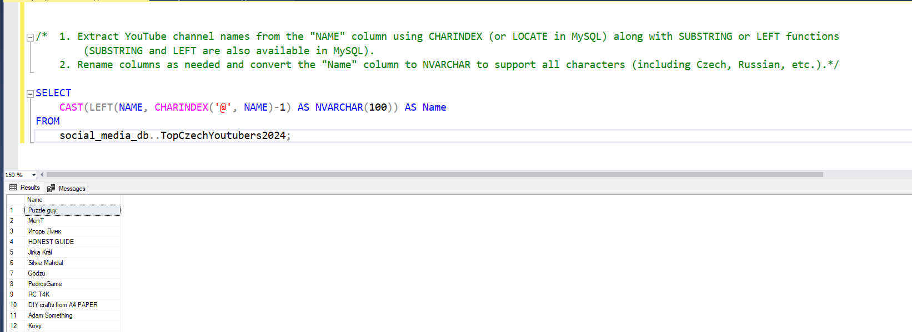

**2) Vytvoření SQL pohledu**   

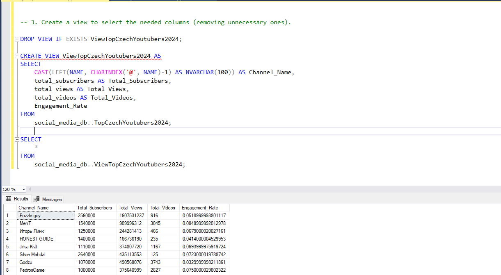

### Testování dat

- Jak provedeme kontrolu kvality dat?
- Jak budeme validovat data?
  
Zkontrolujeme následující:

Počet řádků a sloupců: 

<table>
  <tr>
    <th style="text-align: center;">Ukazatel</th>
    <th style="text-align: center;">Hodnota</th>
  </tr>
  <tr>
    <td style="text-align: center;">Počet řádků</td>
    <td style="text-align: center;">100</td>
  </tr>
  <tr>
    <td style="text-align: center;">Počet sloupců</td>
    <td style="text-align: center;">5</td>
  </tr>
</table>  

Data types a column names:  

<table>
  <tr>
    <th style="text-align: center;">Název sloupce</th>
    <th style="text-align: center;">Datový typ</th>
  </tr>
  <tr>
    <td style="text-align: center;">channel_name</td>
    <td style="text-align: center;">NVARCHAR</td>
  </tr>
  <tr>
    <td style="text-align: center;">total_subscribers</td>
    <td style="text-align: center;">INTEGER</td>
  </tr>
    <tr>
    <td style="text-align: center;">total_views</td>
    <td style="text-align: center;">NVARCHAR</td>
  </tr>
  <tr>
    <td style="text-align: center;">total_videos</td>
    <td style="text-align: center;">INTEGER</td>
  </tr>
  <tr>
    <td style="text-align: center;">engagement_rate</td>
    <td style="text-align: center;">FLOAT</td>
  </tr>
</table>  

Byly provedeny následující kroky vedoucí k zajištění, aby byl dataset připravený pro analýzu.

**Kontrola počtu řádků**
- SQL dotaz s výstupem:

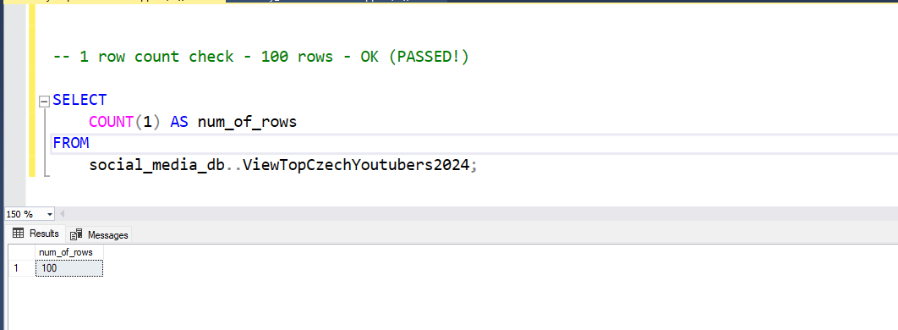

**Kontrola počtu sloupců**
- SQL dotaz s výstupem:

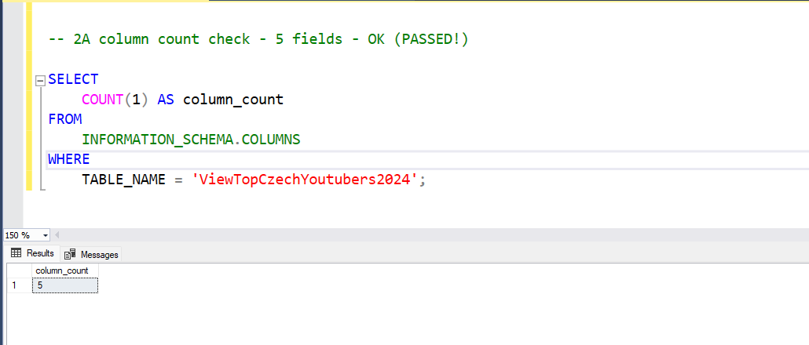

**Kontrola názvů sloupců**
- SQL dotaz s výstupem:
  
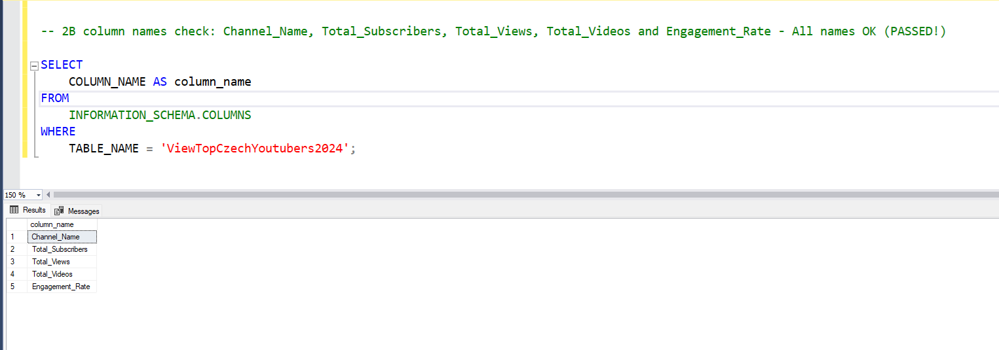

**Kontrola datových typů** 
- SQL dotaz s výstupem:

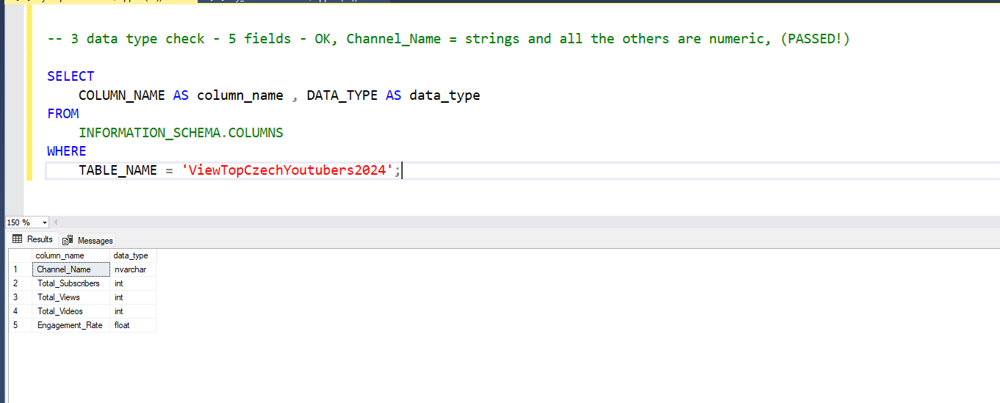

**Kontrola duplicit**  
- SQL dotaz s výstupem:

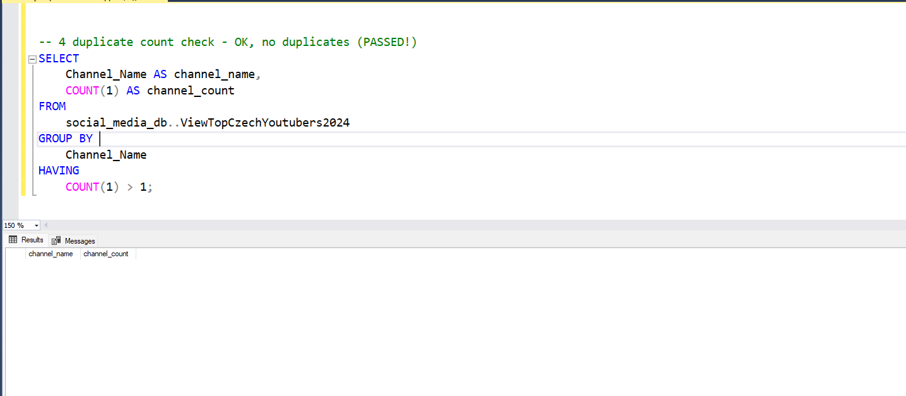
  
## Vizualizace

### Vizualizace dat

- Dashboardu v Power BI zobrazuje nejlepší české YouTubery v roce 2024:

**Obrázek**
  
  
**Gif**
  

### Výpočty

#### DAX metriky v Power BI

1) Celkový počet odběratelů (M)  

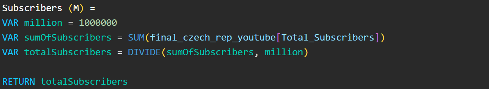  

2) Celkový počet videí  

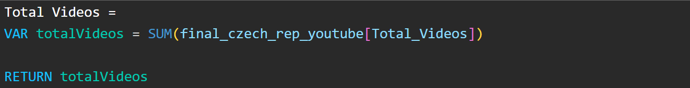  

3) Celkový počet zhlédnutí (M)  

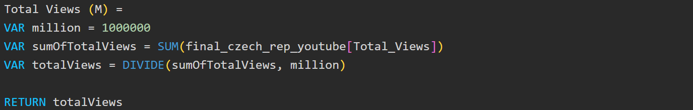  

4) Průměrný počet zhlédnutí na video (M)  

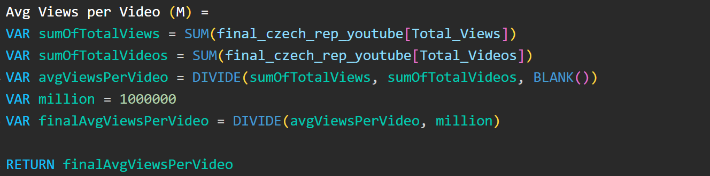  

5) Míra zapojení uživatelů  

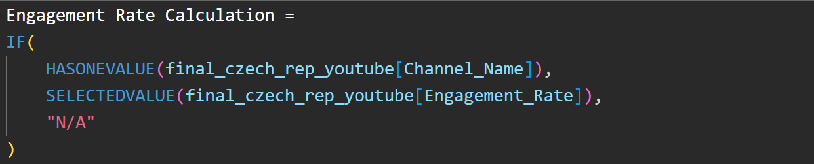  

6) Zhlédnutí na odběratele  

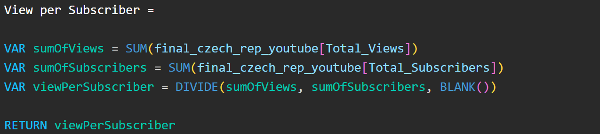  

#### Metriky v Tableau

1) Průměrný počet zhlédnutí na video  

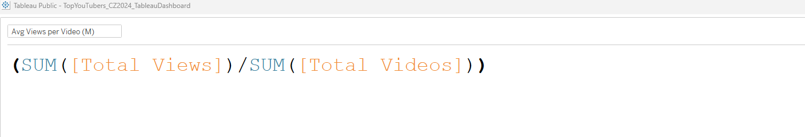  

2) Míra zapojení  

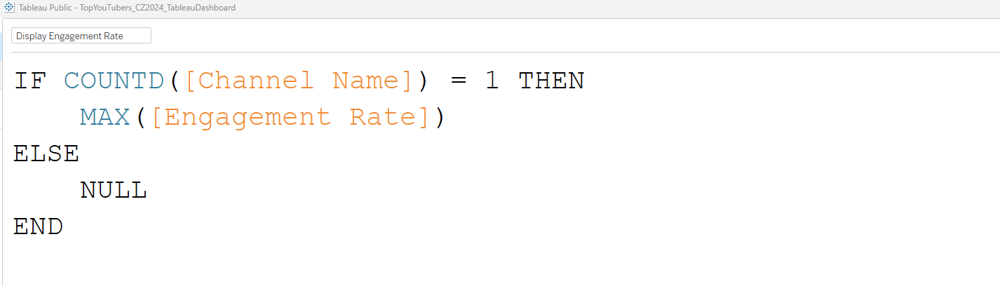  

3) Zhlédnutí na odběratele  

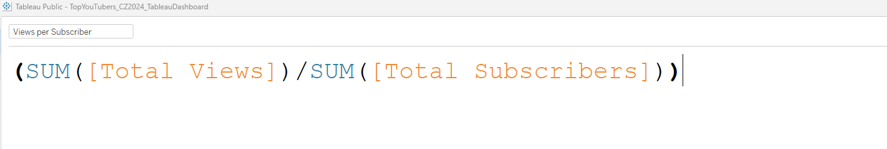  

## Analýza

### Přehled výsledků

V rámci analýzy se pokusíme zodpovědět otázky, které by měly poskytnout odpovědi našemu marketingovému oddělení.  

Hlavní témata jsou:  

- Kterých 10 youtuberů (kanálů) má nejvíce odběratelů?
- 10 youtuberů (kanálů), kteří zveřejnili nejvíce videí?  
- Kteří youtubeři (10 nej kanálů) mají nejvyšší počet zhlédnutí videí?
- Kteří youtubeři (10 nej kanálů) mají nejvyšší průměrný počet zhlédnutí na video?  
- Kteří youtubeři (10 nej kanálů) mají nejlepší poměr zhlédnutí k odběratelům?  
- Kterých 10 youtuberů (kanálů) má nejvyšší míru zapojení odběratelů?  

**1) Kterých 10 youtuberů (kanálů) má nejvíce odběratelů?**  

| Rank | Název kanálu                  |   Odběratel (M) |
|------|-------------------------------|-----------------|
| 1    | Silvie Mahdal                 |       2.64      |
| 2    | Puzzle guy                    |       2.56      |
| 3    | MenT                          |       1.54      | 
| 4    | HONEST GUIDE                  |       1.40      |
| 5    | Adam Something                |       1.28      |
| 6    | Alexander Zakshevsky          |       1.25      |
| 7    | Игорь Линк                    |       1.25      |
| 8    | DIY crafts from A4 PAPER      |       1.22      |
| 9    | FIZIstyle                     |       1.16      |
| 10   | Mr. Michal                    |       1.12      |  

**2) 10 youtuberů (kanálů), kteří zveřejnili nejvíce videí?** 

| Rank | Název kanálu                      |  Počet videí (M) |
|------|-----------------------------------|:----------------:|
| 1    | Radio Free Europe/Radio Liberty   |     9,649        |
| 2    | Totalfilm.cz                      |     7,812        |
| 3    | Алексей Ворон                     |     5,001        |
| 4    | Godzu                             |     3,743        |
| 5    | Agraelus                          |     3,315        |
| 6    | Sterakdary                        |     3,085        |
| 7    | MenT                              |     3,045        |
| 8    | Alkanhraje                        |     2,952        |
| 9    | PedrosGame                        |     2,827        |
| 10   | Alexander Zakshevsky              |     2,780        |  

**3) Kteří youtubeři (10 nej kanálů) mají nejvyšší počet zhlédnutí videí?**  

| Rank | Název kanálu                          |  Počet zhlédnutí (M) |
|:---- |:--------------------------------------|:--------------------:|
| 1    | Puzzle guy                            |      1,607.53        |
| 2    | MenT                                  |        910.00        |
| 3    | Baxtrix                               |        776.72        |
| 4    | FIZIstyle                             |        733.69        |
| 5    | Milion Plus                           |        675.20        |
| 6    | SirYakari                             |        620.42        |
| 7    | Štístko a Poupěnka                    |        602.02        |
| 8    | ViralBrothers SHOW                    |        552.84        |
| 9    | Blakkwood Records                     |        540.98        |
| 10   | Radio Free Europe/Radio Liberty       |        535.21        |  

**4) Kteří youtubeři (10 nej kanálů) mají nejvyšší průměrný počet zhlédnutí na video?**  

| Rank | Název kanálu             |  Průměrný počet zhlédnutí/video (M) |
|:---- |:---------------------------|:-----------------------------------:|
| 1    | ViralBrothers SHOW         |                 6.66                |
| 2    | Mr. Michal                 |                 4.56                |
| 3    | atomic marvel              |                 4.19                |
| 4    | Prague Cello Quartet       |                 3.92                |
| 5    | BESPREDEL                  |                 3.81                |
| 6    | Štístko a Poupěnka         |                 3.76                |
| 7    | Pat a Mat                  |                 3.48                |
| 8    | Silvie Mahdal              |                 3.48                |
| 9    | Slza                       |                 3.35                |
| 10   | Ben Cristovao              |                 2.26                |  

**5) Kteří youtubeři (10 nej kanálů) mají nejlepší poměr zhlédnutí vůči odběratelům?**

| Rank | Název kanálu               | Počet zhlédnutí/počet odběratelů |
|:---- |:---------------------------|:--------------------------------:|
| 1    | Štístko a Poupěnka         |                1568              |
| 2    | Totalfilm.cz               |                1146              |
| 3    | tynikdy                    |                1143              |
| 4    | Milion Plus                |                1089              |
| 5    | Blakkwood Records          |                1065              |
| 6    | Tvoje tvář má známý hlas   |                 994              |
| 7    | Baxtrix                    |                 873              |
| 8    | Pokáčovo Kanál             |                 758              |
| 9    | TOP veci do 2 minut        |                 734              |
| 10   | Alkanhraje                 |                 729              |  

**6) Kterých 10 youtuberů (kanálů) má nejvyšší míru zapojení odběratelů?  **

| Rank | Název kanálu             |    Míra zapojení    |
|:---- |:-------------------------|:-------------------:|
| 1    | Suara Injil              |        14.87%       |
| 2    | Alexander Zakshevsky     |        13.01%       |
| 3    | Алексей Ворон            |        12.85%       |
| 4    | SmusaGames               |         9.91%       |
| 5    | Wedry                    |         9.28%       |
| 6    | PIERRE XO                |         9.07%       |
| 7    | Jmenuju Se Martin        |         8.52%       |
| 8    | MenT                     |         8.49%       |
| 9    | NejFake                  |         8.37%       |
| 10   | Stay12                   |         8.33%       |  

V analýze se primárně zaměřujeme na klíčové metriky, které jsou nezbytné pro dosažení očekávané návratnosti investic (ROI) pro naše marketingové oddělení. Konkrétně se soustředíme na YouTube kanály/youtubery s nejvyšším počtem odběratelů, celkovým největším počtem nahraných videí a celkovým největším počtem zhlédnutí. Analyzováním těchto metrik si klademe za cíl identifikovat nejvhodnější youtubery, abychom optimalizovali úsilí našeho marketingového oddělení na YouTube.

### Validation - Scenarios  

These metrics (YouTube channels with the highest number of subscribers, total videos uploaded, and total views) will be used in three simulation scenarios through which we will attempt to find suitable YouTubers. These scenarios will help us evaluate different approaches and campaign costs, allowing us to visualize the varying profitability of individual campaigns.

#### 1) Scenario: Collaboration (based on product placement) with YouTubers (YouTube Channels) with the Most Subscribers 

The idea of this scenario is to consider the profitability of **product placements** in videos by collaborating with YouTubers who have the highest number of subscribers. We will identify the 3 most suitable YouTubers (YouTube channels).  

*Campaign Variables in 1. Scenario*  

| Item                               | Value                |
|------------------------------------|----------------------|
| Product cost                       | 200 CZK              |
| Conversion rate                    | 2 %                  |
| Campaign cost (one-time fee/period)| 500,000.00 CZK       |  

*3 Most Suitable YouTubers (YouTube channels) in 1. Scenario*  

| Rank    | CHANNEL NAME       | MAIN TOPIC              |
|---------|--------------------|-------------------------|
| **1**   | **Mr. Michal**     | **Entertainment**       |
| 2       | Silvie Mahdal      | Drawing tutorials       |
| 3       | Puzzle Guy         | Puzzle content          |  
  
  
**1) Mr. Michal**
   
   - Average views per video = 4.56 million
   - Product cost = 200 CZK
   - Potential product sales per video =  4.56 million * 2 % (conversion rate) = 91,200.00 (units)
   - Potential revenue per video = 91,200.00 (units) * 200 (CZK) = 18,240,000.00 CZK
   - Campaign cost (one-time fee/period) =  500,000.00 CZK
   - Potential net profit =  18,240,000.00 (CZK) - 500,000.00 (CZK) = 17,740,000.00 CZK  

**2) Silvie Mahdal**
   
   - Average views per video = 3.48 million
   - Product cost = 200 CZK
   - Potential product sales per video = 3.48 million * 2 % (conversion rate) = 69,600.00 (units)
   - Potential revenue per video = 69,600.00 (units) * 200 (CZK) = 13,920,000.00 CZK
   - Campaign cost (one-time fee/period) = 500,000.00 CZK
   - Potential net profit =  13,920,000.00 (CZK) - 500,000.00 (CZK) = 13,420,000.00 CZK  

**3) Puzzle guy**
   
   - Average views per video = 1.75 million
   - Product cost = 200 CZK
   - Potential product sales per video = 1.75 million * 2 % (conversion rate) = 35,000.00 (units)
   - Potential revenue per video = 35,000.00 (units) * 200 (CZK) = 7,000,000.00 CZK
   - Campaign cost (one-time fee/period) = 500,000.00 CZK
   - Potential net profit =  7,000,000.00 (CZK) - 500,000.00 (CZK) = 6,500,000.00 CZK  

   Best alternative in this scenario is **Mr. Michal** with **17,740,000.00 CZK** potential net profit.  

**SQL Query - Variables Initialization for 1st Scenario**  

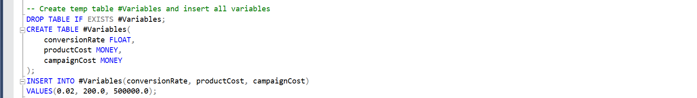

**SQL Query - Code and Output for 1st Scenario**

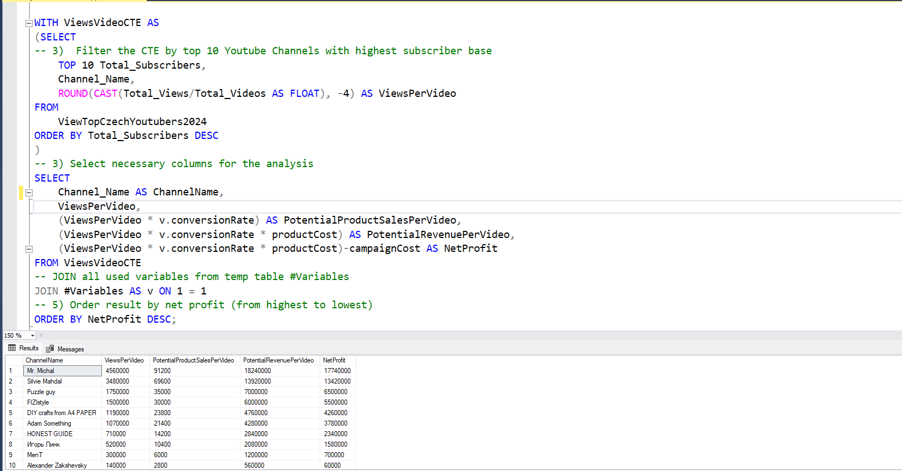

#### 2) Scenario: Collaboration (based on video series) with YouTubers (YouTube channels) Who Have Uploaded the Most Videos  
  
The goal of this scenario is to evaluate the profitability of video series through sponsorships with YouTubers who have the highest number of uploaded videos. We will select the three most suitable YouTubers (YouTube channels).

*Campaign Variables in 2. Scenario* 

| Item                        | Value                |
|-----------------------------|----------------------|
| Product cost                | 200 CZK              |
| Conversion rate             | 2 %                  |
| Campaign cost per video     | 50,000.00 CZK        |  
| Number of videos            | 12                   |
| Total campaign cost         | 600,000.00 CZK       |  
  
*3 Most Suitable YouTubers (YouTube channels) in 2. Scenario*  

| Rank    | CHANNEL NAME           | MAIN TOPIC           |
|---------|------------------------|----------------------|
| **1**   | **MenT**               | **Gaming content**   |
| 2       | Alexander Zakshevsky   | Music                |
| 3       | Godzu                  | Gaming content       |
| 3       | PedrosGame             | Gaming content       |  
  
**1) MenT**
   
   - Average views per video = 300,000
   - Product cost = 200 CZK
   - Potential product sales per video =  300,000 * 2 % (conversion rate) = 6,000.00 (units)  
   - Potential revenue per video = 6,000.00 (units) * 200 (CZK) = 1,200,000.00 CZK  
   - Campaign cost per video = 50,000.00 CZK
   - Number of videos = 12
   - Total campaign cost = 50,000.00 (CZK) * 12 (videos) = 600,000 CZK
   - Potential net profit = 1,200,000.00 (CZK) - 600,000 (CZK) = 600,000.00 CZK  

**2) Alexander Zakshevsky**
   
   - Average views per video = 140,000
   - Product cost = 200 CZK
   - Potential product sales per video = 140,000 * 2 % (conversion rate) = 2,800.00 (units)
   - Potential revenue per video = 2,800.00 (units) * 200 (CZK) = 560,000.00 CZK
   - Campaign cost per video = 50,000.00 CZK
   - Number of videos = 12
   - Total campaign cost = 50,000.00 (CZK) * 12 (videos) = 600,000 CZK
   - Potential net profit = 560,000.00 (CZK) - 600,000 (CZK) = -40,000.00 CZK **(potential loss)** 

**3) Godzu**
   
   - Average views per video = 130,000
   - Product cost = 200 CZK
   - Potential product sales per video = 130,000 * 2 % (conversion rate) = 2,600.00 (units)
   - Potential revenue per video = 2,600.00 (units) * 200 (CZK) = 520,000.00 CZK
   - Campaign cost per video = 50,000.00 CZK
   - Number of videos = 12
   - Total campaign cost = 50,000.00 (CZK) * 12 (videos) = 600,000 CZK
   - Potential net profit =  520,000.00 (CZK) - 600,000 (CZK) = -80,000.000 (CZK) **(potential loss)** 

**3) PedrosGame**
   
   - Average views per video = 130,000
   - Product cost = 200 CZK
   - Potential product sales per video = 130,000 * 2 % (conversion rate) = 2,600.00 (units)
   - Potential revenue per video = 2,600.00 (units) * 200 (CZK) = 520,000.00 CZK
   - Campaign cost per video = 50,000.00 CZK
   - Number of videos = 12
   - Total campaign cost = 50,000.00 (CZK) * 12 (videos) = 600,000 CZK
   - Potential net profit =  520,000.00 (CZK) - 600,000 (CZK) = -80,000.000 (CZK) **(potential loss)** 

   The best and only alternative in this scenario, if we want to achieve a profit, is **MenT** with **600,000.00 CZK** potential net profit.  

**SQL Query - Variables Initialization for 2nd Scenario**  

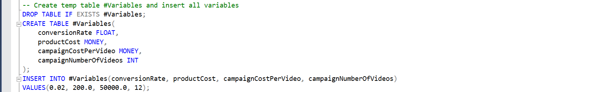

**SQL Query - Code and Output for 2nd Scenario**

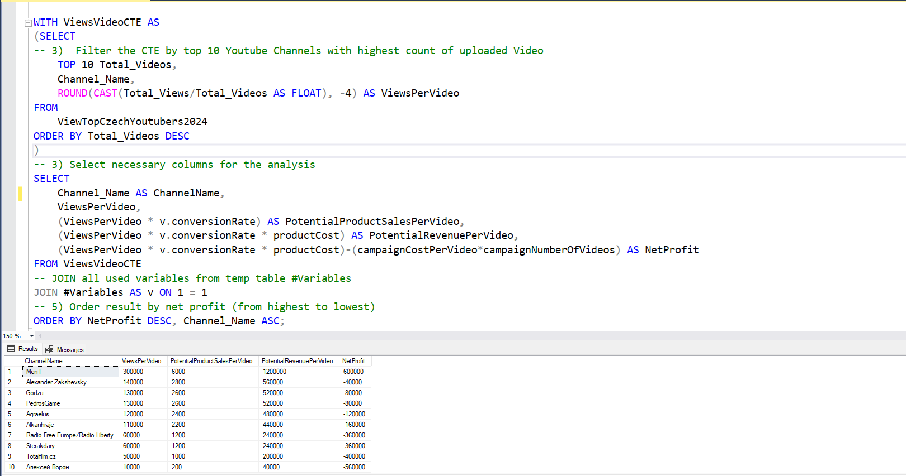
  
#### 3) Scenario: Collaboration with YouTubers (YouTube Channels) with the most views  

In this scenario, we aim to analyze YouTubers with the highest view counts. Our focus will be on evaluating the profitability of influencer marketing (with a 2.5 to 3-month contract) through collaborations with these YouTubers. To achieve this, we will select the three most suitable YouTubers (YouTube channels) for our campaign.

*Campaign Variables in 3. Scenario* 

| Item                                | Value                 |
|-------------------------------------|-----------------------|
| Product cost                        | 200 CZK               |
| Conversion rate                     | 2 %                   |
| Total campaign cost  (2.5-3 months) | 960,000.00 CZK        |  
  
*3 Most Suitable YouTubers (YouTube channels) in 3. Scenario*  

| Rank | CHANNEL NAME              | MAIN TOPIC               |
|------|---------------------------|--------------------------|
| 1    | ViralBrothers SHOW        | Entertainment            |
| 2    | Štístko a Poupěnka        | Children's entertainment |
| 3    | Puzzle Guy                | Puzzle solving           |  

**1) ViralBrothers SHOW**
   
   - Average views per video = 6.66 million
   - Product cost = 200 CZK
   - Potential product sales per video =  6.66 million * 2 % (conversion rate) = 133,200.00 (units)
   - Potential revenue per video = 133,200.00 (units) * 200 (CZK) = 26,640,000.00 CZK
   - Campaign cost (Contract duration: 2.5 to 3 months based on fee variability) =  960,000.00 CZK
   - Potential net profit =  26,640,000.00 (CZK) - 960,000.00 (CZK) = 25,680,000.00 CZK  

**2) Štístko a Poupěnka**
   
   - Average views per video = 3.76 million
   - Product cost = 200 CZK
   - Potential product sales per video = 3.76 million * 2 % (conversion rate) = 75,200.00 (units)
   - Potential revenue per video = 75,200.00 (units) * 200 (CZK) = 15,040,000.00 CZK
   - Campaign cost (Contract duration: 2.5 to 3 months based on fee variability) = 960,000.00 CZK
   - Potential net profit =  15,040,000.00 (CZK) - 960,000.00 (CZK) = 14,080,000.00 CZK  

**3) Puzzle guy**
   
   - Average views per video = 1.75 million
   - Product cost = 200 CZK
   - Potential product sales per video = 1.75 million * 2 % (conversion rate) = 35,000.00 (units)
   - Potential revenue per video = 35,000.00 (units) * 200 (CZK) = 7,000,000.00 CZK
   - Campaign cost (Contract duration: 2.5 to 3 months based on fee variability) = 960,000.00 CZK
   - Potential net profit =  7,000,000.00 (CZK) - 960,000.00 (CZK) = 6,040,000.00 CZK

     Best alternative in this scenario is **ViralBrothers SHOW** with **25,680,000.00 CZK** potential net profit.  

**SQL Query - Variables Initialization for 3rd Scenario**  

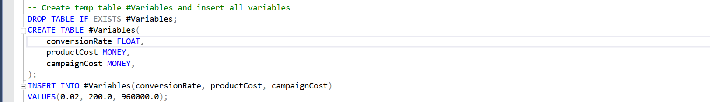  

**SQL Query - Code and Output for 3rd Scenario**  

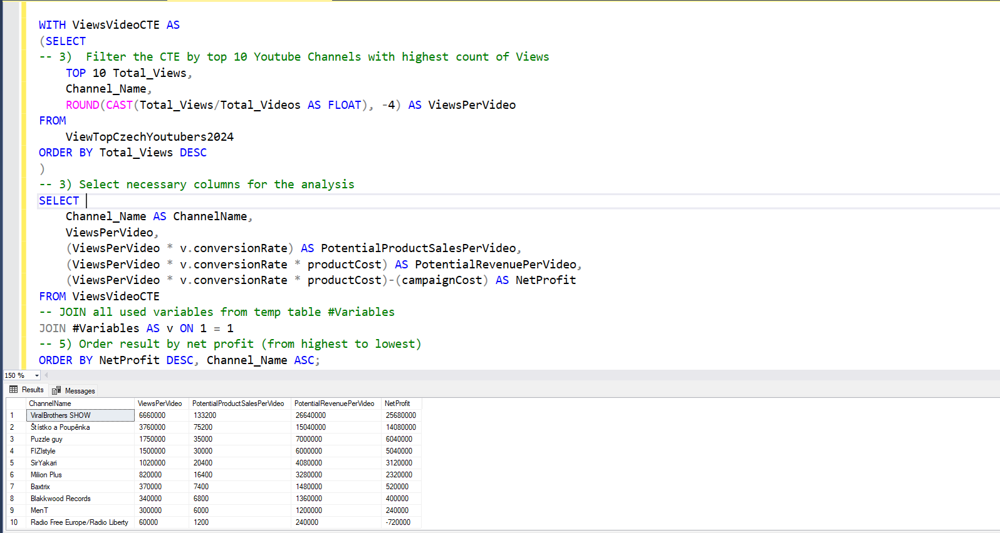  

## Conclusion

In this section, we will summarize the main information from our analysis and, based on these insights, provide recommendations for the marketing department.

### Findings

1) Regarding the YouTubers (YouTube channels) with the most subscribers, we found out:
   
  - Silvie Mahdal, Puzzle Guy and  MenT are the once with the highest number of subscribers in the Czech Republic in 2024.
  - All 10 YouTubers (YouTube channels) with the most subscribers have over 1 million subscribers.
  - In the 1st scenario (collaboration based on product placement), the most suitable YouTuber is Mr. Michal, with a
    potential net profit of over 17.7 million CZK, followed by Silvie Mahdal with a potential net profit of over 13.4           million CZK, and Puzzle Guy in 3rd place with a potential net profit of 6.5 million CZK.

2) Focusing on the YouTubers (YouTube channels) with the most uploaded videos, we learned:
   
  - The YouTubers (YouTube channels) that posted the most content (including Radio Free Europe/Radio Liberty with               9,649 videos uploaded) did not suceed in the 2nd Scenario.
  - The only YouTuber (YouTube channel) able to generate profit in the 2nd Scenario is MenT, with a potential net profit         600,000.00 CZK. All others show a potential loss.
  - This Scenario appears to be less productive and much riskier compared to the others.

3) By concentrating on the YouTubers (YouTube channels) with the most views, we discovered:
   
  - Puzzle Guy is the YouTuber with the highest total view count. With over 1.6 billion views, he is by far the leader in       this category. The second, MenT, has 697 million fewer views, with a total of only 910 million. The remaining YouTubers     (YouTube channels) have between 535 million and 777 million views.
  - In the 3rd scenario (Collaboration with YouTubers with the most views based on contract), the most suitable YouTuber is     ViralBrothers SHOW, with a potential net profit of over 25.6 million CZK, followed by Štístko a Poupěnka with a             potential net profit of over 14 million CZK, and Puzzle Guy with a potential net profit of over 6 million CZK (this         YouTuber also succeeded in the 1st scenario).

Across all categories, YouTubers (YouTube channels) focusing on entertainment, gaming content, or music, tend to dominate, likely due to their consistent posting on the platform.

### Recommendations  

#### Resume

1) **The best YouTuber (YouTube channel) we recommend collaborating with based on product placement (the first scenario) is Mr. Michal**, as he is the optimal choice for enhancing visibility on YouTube and achieving the highest potential net profit (over 17.7 million CZK). While he may not have the largest subscriber base, his high views per video make him a valuable partner for our marketing campaign.

2) As mentioned in the Findings section, the second scenario appears to be dramatically less productive, resulting in a significantly lower return on investment. There is only one YouTuber worth considering in this case: MenT (gaming content), who can generate potential net profit, unlike other YouTubers in this category who are regular publishers. If our company were to focus on gaming content, there are likely better alternatives, such as SirYakari (even though he was not part of this scenario, in the third scenario, he performed significantly better than MenT). Despite posting less frequently, SirYakari averages 1 million views per video and generates over 3.1 million CZK in net profit, positioning him as a leader among YouTubers in the gaming content genre. In the case of focusing specifically on gaming content, it is worth mentioning the need for a deeper analysis, which would consider factors such as engagement rate, the specific content of gaming videos, and the overall activity of YouTubers in the past year. **Given all the factors mentioned, we do not recommend anyone in this scenario.**

3) **ViralBrothers SHOW is the best YouTuber (YouTube channel) to collaborate with based on contract if we are interested in maximizing our reach (the third scenario)**, as it offers significantly higher average views per video, leading to the highest potential net profit (25,680,000.00 CZK). However, if we focus on small children's products, it would be worth considering the channel Štístko a Poupěnka because of its specific genre, even though its subscriber base is dramatically lower.

4) **The top YouTubers to collaborate with based on our findings are ViralBrothers SHOW and Mr. Michal.** They are the best options due to their main genre of entertainment, which is broader compared to the other selected YouTubers. Both also have a fairly large subscriber base, and combined with their high profit potential, they are good candidates for long-term cooperation.
If we are looking for a specific genre to focus on, such as drawing or even puzzle-solving, then Silvie Mahdal (potentially Puzzle Guy) could also be a good option. Their subscriber base and engagement rate are the highest, but their content is aimed at a narrow audience.

#### Potential profit  

1) Signing a contract with the YouTube channel ViralBrothers SHOW could result in a net profit of 25,680,000 CZK.  
2) Collaboration with YouTuber Mr. Michal would bring us net profit of 17,740,000.00 CZK.  
3) From an influencer marketing contract with the YouTube channel Štístko a Poupěnka, we could expect a profit of 14,080,000 CZK.  
4) A partnership based on product placement with YouTuber Silvie Mahdal could generate a profit of 13,420,000 CZK.  
5) A product placement campaign with YouTuber Puzzle Guy could generate a profit of 6,500,000 CZK, while a contract-based collaboration would bring in 6,040,000 CZK.  
   
#### Course of Action

Based on this analysis (relying on the publicly available information), the best Youtube channel to cooperate on promotion of our product in long term partnership is ViralBrothers SHOW. 

We will discuss the possibilities with our marketing department to confirm the expectations for the collaborations. It is important to validate whether all requirements have been met. For example, we may find that expectations have changed, such as targeting a more specific audience or that profit is no longer a priority. Based on this, we may reconsider our recommendations (or dig deeper into the analysis to monitor trends and patterns over a longer period) or move forward with potential collaborations with ViralBrothers SHOW or Mr. Michal in the future.

What actions should we take afterward to implement the suggested decisions?

- Reach out to the teams associated with the ViralBrothers SHOW and/or Mr. Michal channels.
- Negotiate contracts that remain within the budget set for each marketing campaign.
- Launch the campaigns and monitor their performance against our established KPIs.
- Assess the results of the campaigns, gather insights, and optimize based on feedback from converted customers and the audiences of each channel.

#### Concluding Thoughts

**What sort of actions should we undertake before we really decide (and start to implement the marketing strategy) and why do we believe they are important?**

Should we focus on a deeper analysis?
Considering all the information we have, it is clearly insufficient for such a complex task, and we should conduct at least a further in-depth analysis of both mentioned channels. Specifically, we would be interested in:

- **Engagement rate:** This measures how many followers not only watch the videos but also engage through comments, likes, and shares. This will help us determine how engaged the audiences of these channels are. From the information available to us, we know that ViralBrothers SHOW has an engagement rate of 2.13%, while Mr. Michal has 3.32%. However, I did not use these figures for deeper analysis because they come from a different source than the other data. Although it has been verified that these data should be from the same period, we cannot state that with certainty; therefore, this figure was used more as a supplementary reference and for visualization in the dashboard.

- **Audience demographics**: Specifically, whether the channel’s focus aligns with the demographics of our average client (age, gender, interests).

- **Channel reach demographics:** Essentially, in which country or countries the YouTuber has the most impact on their followers.

- **Channel focus:** Whether the channel’s focus aligns with the product.

- **Reputation and credibility:** This refers to the YouTuber's reputation and whether they appear trustworthy and authentic.

- **Trends in follower growth:** This would provide us insights into the channel’s performance over time.

- **Frequency of video posting and overall annual activity on the channel:** This metric indicates the YouTuber's consistency in posting; a regular upload schedule helps maintain audience engagement and attract new subscribers. Additionally, understanding annual activity provides insight into how the YouTuber adapts to trends and keeps content fresh and relevant.

Conducting all of these actions is recommended after this analysis to ensure we are truly confident in our choice of YouTuber for our product. However, this would require access to non-public information or, alternatively, gathering publicly available information through further research, as this data is not typically summarized anywhere outside of paid databases. Therefore, everything mentioned above also answers the question of whether commonly available information is sufficient to fulfill the task assigned to us by the marketing department, and we do not consider it sufficient. That is why we recommend the actions mentioned above.

