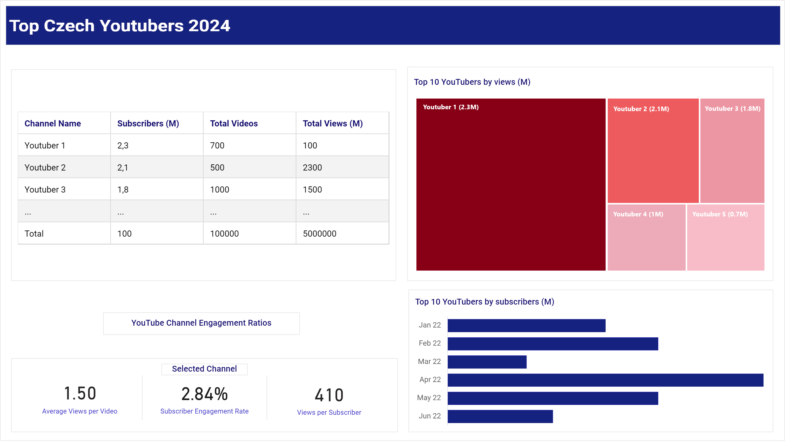
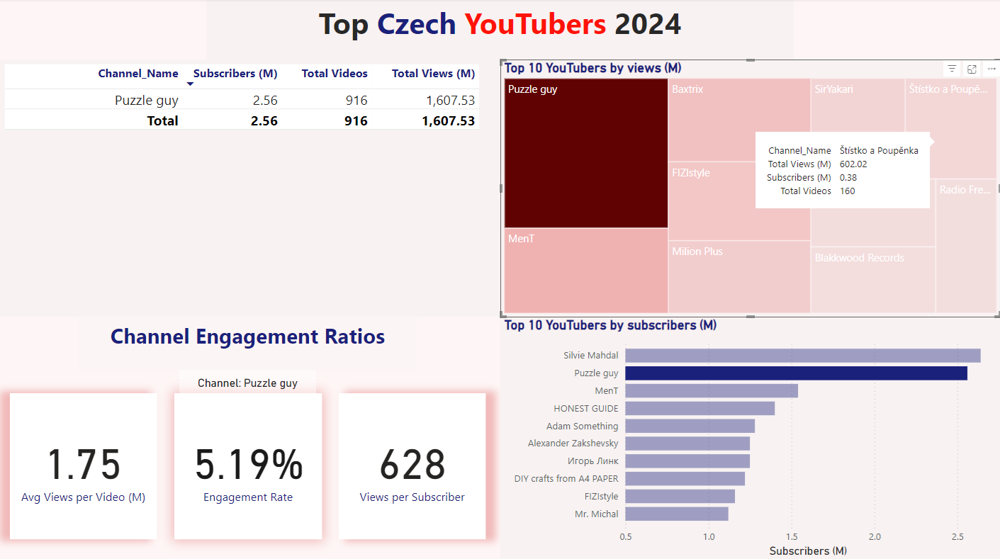

# NEJLEPŠÍ ČEŠTÍ YOUTUBEŘI 2024

## Obsah

- [Účel projektu](#účel-projektu)
  - [Cíl](#cíl)
  - [Návrh řešení](#návrh-řešení)
- [Zdroj dat](#zdroj-dat)
- [Fáze projektu](#fáze-projektu)
- [Návrh dashboardu](#návrh-dashboardu)
  - [Požadované prvky dashboardu](#požadované-prvky-dashboardu)
  - [Vizualizace dashboardu](#vizualizace-dashboardu)
  - [Využité nástroje](#využité-nástroje)
- [Proces vývoje - obecný postup](#proces-vývoje---obecný-postup)
- [Zkoumání dat](#zkoumání-dat)
- [Čistění a testování dat](#čistění-a-testování-dat)
  - [Čistění a příprava](#čistění-a-příprava)
  - [Testování dat](#testování-dat)
- [Vizualizace](#vizualizace)
  - [Vizualizace dat](#vizualizace-dat)
  - [Výpočty](#výpočty)
- [Analýza](#analýza)
  - [Přehled výsledků](#přehled-výsledků)
  - [Simulace scénářů](#simulace-scénářů)
- [Závěr](#závěr)
  - [Zjištění](#zjištění)
  - [Doporučení](#doporučení)

## Účel projektu

### Cíl
Marketingové oddělení chce identifikovat a analyzovat nejlepší youTubery v České republice za rok 2024, aby zjistilo, kteří tvůrci by byli nejvhodnější, především z finančního pohledu, pro marketingové kampaně v příštím roce. Mají v plánu se zaměřit na 100 nejlepších youtuberů a chtějí vědět, zda je dostačující vycházet z veřejných zdrojů.  

### Návrh řešení
Je potřeba určit metriky a KPI, které můžeme použít pro porovnání dat. Cílem je vytvořit dashboard, který poskytne informace a pomůže marketingovému týmu učinit informované rozhodnutí o tom, kteří youtubeři jsou vhodní ke spolupráci. Případně dojdeme ke zjištění, že je potřebné získat další informace. Dashboard by měl obsahovat klíčové metriky, jako například:  

- Počet odběratelů  
- Celkový počet zhlédnutí na youtubera  
- Celkový počet nahraných videí na youtubera  
- Míra zapojení odběratelů  
- apod.  

## Zdroj dat
Musíme identifikovat všechna potřebná data a určit zdroje nezbytné k dosažení cíle. Je také důležité zvážit další faktory jako je úložiště dat, velikost datasetu, frekvence aktualizace dat, apod.  

**Jaká data jsou potřeba pro dosažení našich cílů?**  
Potřebná data o nejlepších youtuberech v České republice pro rok 2024 zahrnují jména youtuberů a již zmíněné klíčové metriky, jako jsou:  

- Počet odběratelů
- Počet zhlédnutí
- Počet nahraných videí
- Míra zapojení

Zdroj dat:  
1) <a href="https://starngage.com/plus/en-us/influencer/ranking/youtube/czech-republic" target="_blank">Žebříček nejlepších českých youtuberů</a>  
2) <a href="https://developers.google.com/youtube/v3/getting-started" target="_blank">YouTube API</a>  
3) <a href="https://hypeauditor.com" target="_blank">Další statistiky</a>  

## Fáze projektu:  

- Návrh
- Realizace projektu
- Čistění a testování dat
- Vizualizace
- Analýza
- Závěr

## Návrh dashboardu  

### Požadované prvky dashboardu  

**Co by mělo být součástí dashboardu na základě stanovených požadavků?**  

Abychom vymezili rozsah a obsah dashboardu, musíme nejprve identifikovat některé klíčové otázky, na které by měl odpovídat:  

|    Číslo otázky    |                                    Otázka                                     |
|:------------------:|:------------------------------------------------------------------------------|
|         1          | Kdo jsou nejlepší youtubeři podle počtu odběratelů?                           |
|         2          | Které kanály vyprodukovaly nejvíce videí?                                     |
|         3          | Které kanály mají nejvíce zhlédnutí?                                          |
|         4          | Které kanály dosahují nejvyššího průměrného počtu zhlédnutí na video?         |
|         5          | Které kanály mají nejlepší poměr počtu zhlédnutí vůči počtu odběratelům?      |
|         6          | Které kanály vykazují nejsilnější míru zapojení odběratelů*?                  |  

* *Míra zapojení odběratelů - procento diváků, kteří interagují s obsahem influencera (lajky, komentáře, apod.).*  

Tohle jsou některé základní otázky, na které budeme snažit odpovědět, abychom dosáhli našeho cíle.

### Vizualizace dashboardu

Vizualizace, vhodné pro zodpovězení našich otázek, zahrnují:
Tabulky, KPI ukazatele (metriky jako je míra zapojení, apod.), sloupcové a další grafy.

**Návrh dashboardu:**

### Využité nástroje

| Program              | Důvod k využití                                    |
|----------------------|----------------------------------------------------|
| Jupyter Lab          | Získání dat                                        |
| MS Excel             | Průzkum dat                                        |
| MS SQL Server        | Čistění, příprava, testování a analýza dat         |
| Power BI/Tableau     | Vizualizace                                        |  

## Proces vývoje - obecný postup

Jak probíhá celkový vývoj?  
- Získání dat: Získání potřebných dat (viz část o zdrojích dat).
- Průzkum dat: Analyzování dat v Excelu, abychom porozuměli jejich struktuře a kvalitě.
- Načítání dat: Importování dat do SQL Serveru pro další zpracování.
- Čistění dat: Použití SQL dotazů k očištění a standardizaci dat pro pozdější analýzu.
- Testování dat: Ověření integrity a přesnosti dat pomocí SQL Serveru.
- Vizualizace dat: Vytvoření prezentace dat v Power BI nebo Tableau.
- Formulace poznatků: Formulace poznatků a vyvození závěrů na základě vizualizovaných dat.
- Dokumentace: Příprava dokumentace (včetně komentářů) na podporu závěrů.
- Sdílení: Sdílení vizualizací, doporučení a dokumentace s marketingovým oddělením.
- Zpětná vazba: Shromáždění zpětné vazby od marketingového oddělení/zákazníka a provedení nezbytných úprav projektu (to obvykle zahrnuje také návrat k předchozím krokům).

##  Zkoumání dat

V další fázi získáme přehled o tom, co data obsahují, identifikujeme chyby, nesrovnalosti a další problémy (např. neznámé znaky, poškozený/chybějící text apod.).

- Co jsme zjistili z úvodního průzkumu dat? Co nás zaujalo? Jaké počáteční nedostatky vidíme a jsme skutečně spokojeni s kvalitou a množstvím dat (nikdy asi nebudeme úplně spokojeni s daty, která máme k dispozici)?

 - Dále určíme, zda jsou naše data dostačující: V našem případě se zaměřujeme na to, zda máme alespoň pět základních sloupců, které obsahují potřebná data pro analýzu (viz část o tom, jaká data vyžaduje řešení projektu). Pokud tomu tak není, budeme muset kontaktovat klienta (naše marketingové oddělení) pro získání dalších informací.

 - První sloupec obsahuje nejen název kanálu, ale také ID kanálu. Data jsou oddělena symbolem @, což nám pomůže správně extrahovat názvy kanálů.

 - Některé sloupce obsahují nesprávné formáty dat nebo v nich dokonce chybějí data. Je nutné potvrdit, zda jsou tyto sloupce potřebné. Pokud ano, budeme se jimi dále zabývat během přípravné fáze dat.

- V současnosti obsahuje náš dataset také nepotřebné sloupce. Je proto dobré zvážit, zda některé/všechny z těchto sloupců odstraníme a jakým způsobem to provedeme.

## Čistění a testování dat

### Čistění a příprava

Cílem je upravit náš dataset tak, aby byl připravený k analýze.

##### Data by měla splňovat následující kritéria a omezení:  

- Měly by být zachovány pouze relevantní sloupce.
- Je nutné odstranit všechny duplicity v relevantních sloupcích.
- Je potřeba standardizovat data (přejmenovat názvy sloupců, získat jednoznačné identifikátory, jako jsou ID, názvy kanálů apod.).
- Musíme zvolit vhodné datové typy v jednotlivých sloupcích.
- Sloupce by neměly obsahovat null hodnoty.

#### Jaké kroky jsou potřeba k očištění a úpravě dat do požadovaného formátu?

- **Odstranit duplicity** - V tomto datasetu žádné nejsou.
- **Standardizovat data** - Extrahovat názvy YouTube kanálů z prvního sloupce a přejmenovat tento i ostatní sloupce pomocí vhodných aliasů.
- **Odstranit NULL (nebo prázdné) hodnoty** - V tomto případě nepotřebujeme dále pracovat se sloupci s hodnotami NULL (nebo prázdnými).
- **Odstranit nepotřebné sloupce** - Eliminovat irelevantní sloupce výběrem pouze relevantních (vytvoříme view).

**1) Očištění a standardizování dat**  

**2) Vytvoření SQL pohledu**   

### Testování dat

- Jak provedeme kontrolu kvality dat?
- Jak budeme validovat data?
  
**Zkontrolujeme následující:**  

- Počet řádků a sloupců  

<table>
  <tr>
    <th style="text-align: center;">Ukazatel</th>
    <th style="text-align: center;">Hodnota</th>
  </tr>
  <tr>
    <td style="text-align: center;">Počet řádků</td>
    <td style="text-align: center;">100</td>
  </tr>
  <tr>
    <td style="text-align: center;">Počet sloupců</td>
    <td style="text-align: center;">5</td>
  </tr>
</table>  

- Datový typ a název sloupce  

<table>
  <tr>
    <th style="text-align: center;">Název sloupce</th>
    <th style="text-align: center;">Datový typ</th>
  </tr>
  <tr>
    <td style="text-align: center;">channel_name</td>
    <td style="text-align: center;">NVARCHAR</td>
  </tr>
  <tr>
    <td style="text-align: center;">total_subscribers</td>
    <td style="text-align: center;">INTEGER</td>
  </tr>
    <tr>
    <td style="text-align: center;">total_views</td>
    <td style="text-align: center;">NVARCHAR</td>
  </tr>
  <tr>
    <td style="text-align: center;">total_videos</td>
    <td style="text-align: center;">INTEGER</td>
  </tr>
  <tr>
    <td style="text-align: center;">engagement_rate</td>
    <td style="text-align: center;">FLOAT</td>
  </tr>
</table>  

Byly provedeny následující kroky vedoucí k zajištění, aby byl dataset připravený pro analýzu.

**Kontrola počtu řádků**
- SQL dotaz s výstupem:

**Kontrola počtu sloupců**
- SQL dotaz s výstupem:

**Kontrola názvů sloupců**
- SQL dotaz s výstupem:
  

**Kontrola datových typů** 
- SQL dotaz s výstupem:

**Kontrola duplicit**  
- SQL dotaz s výstupem:

  
## Vizualizace

### Vizualizace dat

- Dashboardu v Power BI zobrazuje nejlepší české youtubery v roce 2024:

**Obrázek**
  
  
**Gif**
  

### Výpočty

#### DAX metriky v Power BI

1) Celkový počet odběratelů (M)  

  

2) Celkový počet videí  

  

3) Celkový počet zhlédnutí (M)  

  

4) Průměrný počet zhlédnutí na video (M)  

  

5) Míra zapojení uživatelů  

  

6) Zhlédnutí na odběratele  

  

#### Metriky v Tableau

1) Průměrný počet zhlédnutí na video  

  

2) Míra zapojení  

  

3) Zhlédnutí na odběratele  

  

## Analýza

### Přehled výsledků

V rámci analýzy se pokusíme zodpovědět otázky, které by měly poskytnout odpovědi našemu marketingovému oddělení.  

Hlavní témata jsou:  

- Kterých 10 youtuberů (kanálů) má nejvíce odběratelů?
- 10 youtuberů (kanálů), kteří zveřejnili nejvíce videí?  
- Kteří youtubeři (10 nej kanálů) mají nejvyšší počet zhlédnutí videí?
- Kteří youtubeři (10 nej kanálů) mají nejvyšší průměrný počet zhlédnutí na video?  
- Kteří youtubeři (10 nej kanálů) mají nejlepší poměr zhlédnutí k odběratelům?  
- Kterých 10 youtuberů (kanálů) má nejvyšší míru zapojení odběratelů?  

**1) Kterých 10 youtuberů (kanálů) má nejvíce odběratelů?**  

| Pořadí | Název kanálu                  |   Odběratel (M) |
|--------|-------------------------------|-----------------|
| 1      | Silvie Mahdal                 |       2.64      |
| 2      | Puzzle guy                    |       2.56      |
| 3      | MenT                          |       1.54      | 
| 4      | HONEST GUIDE                  |       1.40      |
| 5      | Adam Something                |       1.28      |
| 6      | Alexander Zakshevsky          |       1.25      |
| 7      | Игорь Линк                    |       1.25      |
| 8      | DIY crafts from A4 PAPER      |       1.22      |
| 9      | FIZIstyle                     |       1.16      |
| 10     | Mr. Michal                    |       1.12      |  

**2) 10 youtuberů (kanálů), kteří zveřejnili nejvíce videí?**  

| Pořadí | Název kanálu                      |  Počet videí (M) |
|--------|-----------------------------------|:----------------:|
| 1      | Radio Free Europe/Radio Liberty   |     9,649        |
| 2      | Totalfilm.cz                      |     7,812        |
| 3      | Алексей Ворон                     |     5,001        |
| 4      | Godzu                             |     3,743        |
| 5      | Agraelus                          |     3,315        |
| 6      | Sterakdary                        |     3,085        |
| 7      | MenT                              |     3,045        |
| 8      | Alkanhraje                        |     2,952        |
| 9      | PedrosGame                        |     2,827        |
| 10     | Alexander Zakshevsky              |     2,780        |  

**3) Kteří youtubeři (10 nej kanálů) mají nejvyšší počet zhlédnutí videí?**  

| Pořadí | Název kanálu                          |  Počet zhlédnutí (M) |
|:-------|:--------------------------------------|:--------------------:|
| 1      | Puzzle guy                            |      1,607.53        |
| 2      | MenT                                  |        910.00        |
| 3      | Baxtrix                               |        776.72        |
| 4      | FIZIstyle                             |        733.69        |
| 5      | Milion Plus                           |        675.20        |
| 6      | SirYakari                             |        620.42        |
| 7      | Štístko a Poupěnka                    |        602.02        |
| 8      | ViralBrothers SHOW                    |        552.84        |
| 9      | Blakkwood Records                     |        540.98        |
| 10     | Radio Free Europe/Radio Liberty       |        535.21        |  

**4) Kteří youtubeři (10 nej kanálů) mají nejvyšší průměrný počet zhlédnutí na video?**  

| Pořadí | Název kanálu             |  Průměrný počet zhlédnutí/video (M) |
|:-------|:---------------------------|:-----------------------------------:|
| 1      | ViralBrothers SHOW         |                 6.66                |
| 2      | Mr. Michal                 |                 4.56                |
| 3      | atomic marvel              |                 4.19                |
| 4      | Prague Cello Quartet       |                 3.92                |
| 5      | BESPREDEL                  |                 3.81                |
| 6      | Štístko a Poupěnka         |                 3.76                |
| 7      | Pat a Mat                  |                 3.48                |
| 8      | Silvie Mahdal              |                 3.48                |
| 9      | Slza                       |                 3.35                |
| 10     | Ben Cristovao              |                 2.26                |  

**5) Kteří youtubeři (10 nej kanálů) mají nejlepší poměr zhlédnutí vůči odběratelům?**  

| Pořadí | Název kanálu               | Počet zhlédnutí/počet odběratelů |
|:-------|:---------------------------|:--------------------------------:|
| 1      | Štístko a Poupěnka         |                1568              |
| 2      | Totalfilm.cz               |                1146              |
| 3      | tynikdy                    |                1143              |
| 4      | Milion Plus                |                1089              |
| 5      | Blakkwood Records          |                1065              |
| 6      | Tvoje tvář má známý hlas   |                 994              |
| 7      | Baxtrix                    |                 873              |
| 8      | Pokáčovo Kanál             |                 758              |
| 9      | TOP veci do 2 minut        |                 734              |
| 10     | Alkanhraje                 |                 729              |  

**6) Kterých 10 youtuberů (kanálů) má nejvyšší míru zapojení odběratelů?**  

| Pořadí | Název kanálu             |    Míra zapojení    |
|:-------|:-------------------------|:-------------------:|
| 1      | Suara Injil              |        14.87%       |
| 2      | Alexander Zakshevsky     |        13.01%       |
| 3      | Алексей Ворон            |        12.85%       |
| 4      | SmusaGames               |         9.91%       |
| 5      | Wedry                    |         9.28%       |
| 6      | PIERRE XO                |         9.07%       |
| 7      | Jmenuju Se Martin        |         8.52%       |
| 8      | MenT                     |         8.49%       |
| 9      | NejFake                  |         8.37%       |
| 10     | Stay12                   |         8.33%       |  

V analýze se primárně zaměřujeme na klíčové metriky, které jsou nezbytné pro dosažení očekávané návratnosti investic (ROI) pro naše marketingové oddělení. Konkrétně se soustředíme na YouTube kanály/youtubery s nejvyšším počtem odběratelů, celkovým největším počtem nahraných videí a celkovým největším počtem zhlédnutí. Analyzováním těchto metrik si klademe za cíl identifikovat nejvhodnější youtubery, abychom optimalizovali úsilí našeho marketingového oddělení na YouTube.

### Simulace scénářů  

Již dříve zmíněné metriky (počet odběratelů, počet nahraných videí a počet zhlédnutí) budou použity ve třech simulačních scénářích, prostřednictvím kterých se pokusíme najít vhodné youtubery. Tyto scénáře nám pomohou vyhodnotit různé přístupy s rozdílnými náklady na kampaně, což nám umožní vizualizovat rentabilitu jednotlivých kampaní v rámci spolupráce s youtubery.

#### 1) Scénář: Spolupráce (na základě product placement) s youtubery (YouTube kanály) s nejvyšším počtem odběratelů

Cílem tohoto scénáře je posoudit rentabilitu **product placements** prostřednictvím spolupráce s youtubery, kteří mají nejvyšší počet odběratelů. Identifikujeme nejdříve 3 nejlepší/nejvhodnější youtubery (kanály).  

*Proměnné v 1. scénáři*  

| Proměnná                              | Hodnota              |
|---------------------------------------|----------------------|
| Cena produktu                         | 200 Kč               |
| Konverzní míra                        | 2 %                  |
| Náklady na kampaň (jednorázově/období)| 500,000.00 Kč        |  

*3 Nejvhodnější youtubeři (YouTube kanály) v 1. scénáři*  

| Pořadí  | NÁZEV KANÁLU       | HLAVNÍ TÉMA KANÁLU                |
|---------|--------------------|-----------------------------------|
| **1**   | **Mr. Michal**     | **Zábava**                        |
| 2       | Silvie Mahdal      | Tutoriály kreslení                |
| 3       | Puzzle Guy         | Řešení hádanek/puzzle solving/    |  
  
  
**1) Mr. Michal**  
   
   - Průměrný počet zhlédnutí na video = 4,56 milionu 
   - Cena produktu = 200 Kč  
   - Potenciální prodej produktu na video = 4,56 milionu * 2 % (konverzní míra) = 91 200 (ks)  
   - Potenciální příjem na video = 91 200 (ks) * 200 (Kč) = 18 240 000,00 Kč  
   - Náklady na kampaň (jednorázový poplatek/období) = 500 000,00 Kč  
   - Potenciální čistý zisk = 18 240 000,00 (Kč) - 500 000,00 (Kč) = 17 740 000,00 Kč  

**2) Silvie Mahdal**  
   
   - Průměrný počet zhlédnutí na video = 3,48 milionu  
   - Cena produktu = 200 Kč  
   - Potenciální prodej produktu na video = 3,48 milionu * 2 % (konverzní míra) = 69 600 (ks)  
   - Potenciální příjem na video = 69 600 (ks) * 200 (Kč) = 13 920 000,00 Kč  
   - Náklady na kampaň (jednorázový poplatek/období) = 500 000,00 Kč  
   - Potenciální čistý zisk = 13 920 000,00 (Kč) - 500 000,00 (Kč) = 13 420 000,00 Kč  

**3) Puzzle guy**  
   
   - Průměrný počet zhlédnutí na video = 1.75 milionu  
   - Cena produktu = 200 Kč  
   - Potenciální prodej produktu na video = 1.75 milionu * 2 % (konverzní míra) = 35,000.00 (ks)  
   - Potenciální příjem na video = 35 000 (ks) * 200 (Kč) = 7 000 000,00 Kč  
   - Náklady na kampaň (jednorázový poplatek/období) = 500 000,00 Kč  
   - Potenciální čistý zisk = 7 000 000,00 (Kč) - 500 000,00 (Kč) = 6 500 000,00 Kč  

   Nejlepší alternativou v tomto scénáři je **Mr. Michal** s potenciálním čistým ziskem **17 740 000,00 Kč**.  

**SQL Dotaz - Inicializace proměnných pro 1. scénář**  

  

**SQL Dotaz - Kód a výstup pro 1. scénář**  

  

#### 2) Scénář: Spolupráce (na základě video série) s youtubery (YouTube kanály), kteří nahráli nejvíce videí  
  
Cílem tohoto scénáře je vyhodnotit rentabilitu video série, kdy bychom prostřednictvím sponzoringu spolupracovali s youtubery, kteří nahráli nejvíce videí na YouTube. Vybereme tři nejlepší/nejvhodnější youtubery (YouTube kanály).  

*Proměnné v 2. scénáři*  

| Proměnná                    | Hodnota              |
|-----------------------------|----------------------|
| Cena produktu               | 200 Kč               |
| Konverzní míra              | 2 %                  |
| Náklad na video             | 50,000.00 Kč         |  
| Počet videí                 | 12                   |
| Celkové náklady na kampaň   | 600,000.00 Kč        |  
  
*3 nejvhodnější youtubeři (YouTube kanály) ve 2. scénáři*  

| Pořadí  | NÁZEV KANÁLU           | HLAVNÍ TÉMA KANÁLU    |
|---------|------------------------|-----------------------|
| **1**   | **MenT**               | **Herní obsah**       |
| 2       | Alexander Zakshevsky   | Hudba                 |
| 3       | Godzu                  | Herní obsah           |
| 3       | PedrosGame             | Herní obsah           |  
  
**1) MenT**
   
   - Průměrný počet zhlédnutí na video = 300,000
   - Cena produktu = 200 Kč
   - Potenciální prodej produktu na video = 300,000 * 2 % (konverzní míra) = 6,000.00 (ks) 
   - Potenciální příjem na video = 6,000.00 (ks) * 200 (Kč) = 1,200,000.00 Kč 
   - Cena kampaně na video = 50,000.00 Kč
   - Počet videí = 12
   - Celkové náklady kampaně = 50,000.00 (Kč) * 12 (videí) = 600,000 Kč
   - Potenciální čistý zisk = 1,200,000.00 (Kč) - 600,000 (Kč) = 600,000.00 Kč 

**2) Alexander Zakshevsky**
   
   - Průměrný počet zhlédnutí na video = 140,000
   - Cena produktu = 200 Kč
   - Potenciální prodej produktů na video = 140,000 * 2 % (konverzní míra) = 2,800.00 (ks) 
   - Potenciální příjem na video = 2,800.00 (ks) * 200 (Kč) = 560,000.00 Kč
   - Cena kampaně na video = 50,000.00 Kč
   - Počet videí = 12
   - Celkové náklady kampaně = 50,000.00 (Kč) * 12 (videí) = 600,000 Kč
   - Potenciální čistý zisk = 560,000.00 (Kč) - 600,000 (Kč) = -40,000.00 Kč **(potenciální ztráta)**

**3) Godzu**
   
   - Průměrný počet zhlédnutí na video = 130,000
   - Cena produktu = 200 Kč
   - Potenciální prodej produktů na video = 130,000 * 2 % (konverzní míra) = 2,600.00 (ks)
   - Potenciální příjem na video = 2,600.00 (ks) * 200 (Kč) = 520,000.00 Kč
   - Cena kampaně na video = 50,000.00 Kč
   - Počet videí = 12
   - Celkové náklady kampaně = 50,000.00 (Kč) * 12 (videí) = 600,000 Kč
   - Potenciální čistý zisk = 520,000.00 (Kč) - 600,000 (Kč) = -80,000.00 (Kč) **(potenciální ztráta)**

**3) PedrosGame**
   
   - Průměrný počet zhlédnutí na video = 130,000
   - Cena produktu = 200 Kč
   - Potenciální prodej produktů na video = 130,000 * 2 % (konverzní míra) = 2,600.00 (ks)
   - Potenciální příjem na video = 2,600.00 (ks) * 200 (Kč) = 520,000.00 Kč
   - Cena kampaně na video = 50,000.00 Kč
   - Počet videí = 12
   - Celkové náklady kampaně = 50,000.00 (Kč) * 12 (videí) = 600,000 Kč
   - Potenciální čistý zisk = 520,000.00 (Kč) - 600,000 (Kč) = -80,000.00 (Kč) **(potenciální ztráta)**

   Nejlepším (a jediným) řešením v tomto scénáři, pokud chceme dosáhnout zisku, je **MenT** s potenciálním čistým ziskem **600,000.00 Kč**. 

**SQL Dotaz - Inicializace proměnných pro 2. scénář**  

**SQL Dotaz - Kód a výstup pro 2. scénář**

  
#### 3) Scénář: Spolupráce s youtubery (YouTube kanály) s nejvyšším počtem zhlédnutí

V tomto scénáři se zaměříme na analýzu youtuberů s nejvyšším počtem zhlédnutí. Naším cílem bude vyhodnotit rentabilitu influencer marketingu prostřednictvím spolupráce s youtubery (pod 2,5 až 3 měsíční smlouvou). Abychom toho dosáhli, vybereme tři nejvhodnější youtubery (YouTube kanály) pro 3. scénář. 

*Proměnné kampaně ve 3. scénáři* 

| Proměnná                               | Hodnota               |
|----------------------------------------|-----------------------|
| Cena produktu                          | 200 Kč                |
| Konverzní míra                         | 2 %                   |
| Celkové náklady kampaně (2,5-3 měsíce) | 960,000.00 Kč         |  
  
*3 nejvhodnější youtubeři (YouTube kanály) ve 3. scénáři*  

| Rank | NÁZEV KANÁLU              | HLAVNÍ TÉMA KANÁLU               |
|------|---------------------------|----------------------------------|
| **1**| **ViralBrothers SHOW**    | **Zábava**                       |
| 2    | Štístko a Poupěnka        | Zábava pro děti                  |
| 3    | Puzzle Guy                | Řešení hádanek/puzzle solving/   |  

**1) ViralBrothers SHOW**
   
   - Průměrný počet zhlédnutí na video = 6,66 milionu
   - Cena produktu = 200 Kč
   - Potenciální prodej produktu na video = 6,66 milionu * 2 % (konverzní míra) = 133,200.00 (ks)
   - Potenciální příjem na video = 133,200.00 (ks) * 200 (Kč) = 26,640,000.00 Kč
   - Náklady na kampaň (délka smlouvy: 2,5 až 3 měsíce na základě variability poplatku) = 960,000.00 Kč
   - Potenciální čistý zisk = 26,640,000.00 (Kč) - 960,000.00 (Kč) = 25,680,000.00 Kč

**2) Štístko a Poupěnka**
   
   - Průměrný počet zhlédnutí na video = 3,76 milionu
   - Cena produktu = 200 Kč
   - Potenciální prodej produktu na video = 3,76 milionu * 2 % (konverzní míra) = 75,200.00 (ks)
   - Potenciální příjem na video = 75,200.00 (ks) * 200 (Kč) = 15,040,000.00 Kč
   - Náklady na kampaň (délka smlouvy: 2,5 až 3 měsíce na základě variability poplatku) = 960,000.00 Kč
   - Potenciální čistý zisk = 15,040,000.00 (Kč) - 960,000.00 (Kč) = 14,080,000.00 Kč

**3) Puzzle guy**
   
   - Průměrný počet zhlédnutí na video = 1,75 milionu
   - Cena produktu = 200 Kč
   - Potenciální prodej produktu na video = 1,75 milionu * 2 % (konverzní míra) = 35,000.00 (ks)
   - Potenciální příjem na video = 35,000.00 (ks) * 200 (Kč) = 7,000,000.00 Kč
   - Náklady na kampaň (Délka smlouvy: 2,5 až 3 měsíce na základě variability poplatku) = 960,000.00 Kč
   - Potenciální čistý zisk = 7,000,000.00 (Kč) - 960,000.00 (Kč) = 6,040,000.00 Kč

     Nejlepší alternativou v tomto scénáři je kanál **ViralBrothers SHOW** s s potenciálním čistým ziskem **25,680,000.00 Kč**.  

**SQL Dotaz - Inicializace proměnných pro 3. scénář**  

  

**SQL Dotaz - Kód a výstup pro 3. scénář**  

  

## Závěr

V této části shrneme hlavní informace z naší analýzy a na základě těchto poznatků poskytneme doporučení pro marketingové oddělení.

### Zjištění

1) Co se týče YouTuberů (YouTube kanálů) s největším počtem odběratelů, zjistili jsme, že:
   
  - Silvie Mahdal, Puzzle Guy a MenT jsou ti, kteří mají největší počet odběratelů v České republice v roce 2024.
  - Všech 10 youtuberů (kanálů) s nejvíce odběrateli má více než 1 milion odběratelů.
  - V 1. scénáři (spolupráce založená na product placement) je nejvhodnějším YouTuberem Mr. Michal s potenciálním čistým ziskem přes 17,7 milionu Kč, následovaný je Silvií Mahdal s potenciálním čistým ziskem přes 13,4 milionu Kč a na 3. místě je Puzzle Guye s potenciálním čistým ziskem 6,5 milionu Kč.

2) Zaměřením se na youtubery (YouTube kanály) s nejvíce nahranými videi jsme zjistili, že:
   
  - Youtubeři (YouTube kanály), kteří publikovali nejvíce obsahu (včetně Rádia Svobodná Evropa/Rádia Svoboda s 9 649 nahranými videi), nebyli ve 2. scénáři úspěšní.
  - Jediným youtuberem (YouTube kanálem), který dokázal generovat zisk ve 2. scénáři, je MenT, s potenciálním čistým ziskem 600 000 Kč. Všichni ostatní vykazují potenciální ztrátu.
  - Tento scénář se zdá být méně produktivní a mnohem rizikovější ve srovnání s ostatními dvěma scénáři.

3) Když jsme se zaměřili na youtubery (YouTube kanály) s nejvyšším počtem zhlédnutí, zjistili jsme, že:
   
  - Puzzle Guy je youtuber s nejvyšším celkovým počtem zhlédnutí. S více než 1,6 miliardy zhlédnutí je daleko vedoucím v této kategorii. Druhý, MenT, má o 697 milionů zhlédnutí méně, s celkovým počtem 910 milionů. Zbývající youtubeři (YouTube kanály) mají mezi 535 miliony a 777 miliony zhlédnutí.
  - Ve 3. scénáři, kde spolupracujeme s YouTubery (s největším počtem zhlédnutí videí) na základě smlouvy, je nejvhodnějším youtuberem ViralBrothers SHOW s potenciálním čistým ziskem přes 25,6 milionu Kč, následovaný kanálem Štístko a Poupěnka s potenciálním čistým ziskem přes 14 milionů Kč. Na třetím místě je pak Puzzle Guy s potenciálním čistým ziskem přes 6 milionů Kč (tento YouTuber byl také poměrně úspěšný v 1. scénáři).

Ve všech kategoriích dominují YouTubeři (YouTube kanály) zaměřující se na zábavu, herní obsah a nebo hudbu. Je to pravděpodobně způsobené pravidelně zveřejňováným obsahem na platformě, díky čemuž si udržují sledující.

### Doporučení

#### Shrnutí

1) **Nejlepší/nejvhodnější youtuber (YouTube kanál), se kterým doporučujeme spolupracovat na základě product placement (první scénář), je Mr. Michal**, protože je optimální volbou pro zvýšení viditelnosti na YouTube a dosažení nejvyššího potenciálního čistého zisku (přes 17,7 milionu Kč) v této kategorii. I když nemá největší počet odběratelů, jeho vysoká sledovanost videí z něj činí cenného partnera pro naši marketingovou kampaň.

2) Jak bylo zmíněno dříve, druhý scénář se jeví jako výrazně méně produktivní, což vede k podstatně nižšímu profitu a tím pádem i návratu investic (případně dokonce ke ztrátě). Ve 2. scénáři stojí za zvážení pouze jeden youtuber, MenT, který může vygenerovat potenciální čistý zisk, na rozdíl od ostatních youtuberů. Pokud by se naše společnost zaměřila na herní obsah, existují pravděpodobně lepší alternativy, než je MenT. Jako vhodný kandidát se jeví například SirYakari (i když nebyl součástí tohoto scénáře, ve třetím scénáři si vedl výrazně lépe než MenT). Přestože vydává méně často, SirYakari má v průměru 1 milion zhlédnutí na video a generuje přes 3,1 milionu Kč čistého zisku, čímž se řadí mezi lídry mezi youtubery, kteří se zaměřují na hraní her. V případě zaměření se výhradně na herní obsah stojí ale za zmínku také potřeba další hlubší analýzy, která by zohledňovala faktory jako míra zapojení sledujících, konkrétní obsah herních videí a celková aktivita youtuberů za poslední rok. **S ohledem na všechny uvedené faktory v tomto scénáři nikoho nedoporučujeme.**

3) **ViralBrothers SHOW je nejlepší YouTube kanál pro spolupráci (na základě smlouvy), pokud máme zájem maximalizovat dosah (třetí scénář)**, protože nabízí výrazně vyšší průměrný počet zhlédnutí na video, což vede k nejvyššímu potenciálnímu čistému zisku (25,680,000.00 Kč). Pokud bychom se však specializovali na produkty pro malé děti, stálo by za to zvážit kanál Štístko a Poupěnka (díky jeho specifickému žáměření na tvorbu obsahu pro malé děti), i když má výrazně menší počet odběratelů.

4) **Nejlepší YouTubeři pro spolupráci na základě našich zjištění jsou ViralBrothers SHOW a Mr. Michal.** Jsou nejlepší volbou nejen díky žánru, na který se specializují (zábavní obsah), a jež je širší ve srovnání s ostatními vybranými YouTubery, ale mají také poměrně velkou základnu odběratelů. To je pak ve spojení s vysokým potenciálním ziskem indikátor, že jsou skutečně vhodnými kandidáty pro dlouhodobou spolupráci. Pokud hledáme specifický žánr, jako je kreslení nebo řešení hádanek, pak by také Silvie Mahdal, případně Puzzle Guy, mohli být dobrou volbou. Jejich základna odběratelů a míra zapojení jsou nejvyšší, ale jejich obsah je zaměřen na úzké publikum.

#### Možný/potenciální zisk  

1) Podepsání smlouvy s YouTube kanálem ViralBrothers SHOW by mohlo přinést čistý zisk ve výši 25 680 000 Kč.  
2) Spolupráce s youtuberem Mr. Michalem by nám mohla přinést čistý zisk 17 740 000 Kč.
3) Při spolupráci s kanálem Štístko a Poupěnka můžeme očekávat zisk 14 080 000 Kč.
4) Product placement kampaň ve spolupráci s youtuberkou Silvií Mahdal by mohla vygenerovat zisk 13 420 000 Kč.
5) Kampaň zaměřená na product placement ve spolupráci s youtuberem Puzzle Guy by mohla přinést zisk 6 500 000 Kč, zatímco spolupráce na základě smlouvy by mohla vynést 6 040 000 Kč.
   
#### Další postup

Na základě této analýzy (vycházející z veřejně dostupných informací) je nejlepší YouTube kanál pro dlouhodobou spolupráci na propagaci našeho produktu ViralBrothers SHOW.

Prodiskutujeme možnosti s naším marketingovým oddělením, abychom si vzájemně potvrdili očekávání ohledně kampaně. Je důležité ověřit, zda jsou splněny všechny požadavky klienta, v našem případě marketingového oddělení. Například se může stát, že se očekávání změnila, cílíme nově na konkrétnější publikum, nebo že zisk již není naší hlavní prioritou. Na základě toho můžeme doporučení přehodnotit, případně pokračovat v jednání o možné spolupraci s kanálem ViralBrothers SHOW nebo youtuberem Mr. Michal.

Jaké další kroky bychom měli podniknout k realizaci kampaně?

- Navážeme spojení s týmy okolo Youtube kanálů ViralBrothers SHOW a/nebo Mr. Michal.
- Vyjednáme smlouvu/y pohybující se v rámci rozpočtu marketingové kampaně.
- Spustíme kampaň/ně a budeme sledovat její/ich výkon ve vztahu k našim stanoveným KPI.
- Vyhodnotíme výsledky kampaně/í a případně kampaň/ně přehodnotíme na základě zpětné vazby od zákazníků nebo našeho publika.
- 
#### Závěrečné poznatky

**Jaké kroky bychom měli podniknout před skutečným rozhodnutím (a zahájením implementace marketingové strategie) a proč věříme, že jsou důležité?**

Měli bychom se zaměřit na hlubší analýzu?  
Vzhledem ke všem informacím, které máme k dispozici, je jasné, že pro takto komplexní úkol nejsou tyto informace dostačující. Proto bychom měli provést minimálně další analýzu obou zmíněných kanálů (případně, pakliže to dovoluje náš rozpočet, všech zůčastněných kanálů). Zvláště bychom se měli zaměřit na následující faktory:

- **Míra zapojení:** Tato metrika měří nejen, kolik sledujících sleduje videa, ale také kolik se jich aktivně zapojuje do interakce prostřednictvím komentářů, lajků či sdílení. To nám pomůže zjistit, jak angažované je publikum sledovaných kanálů. Z dostupných informací víme, že míra zapojení u kanálu ViralBrothers SHOW je 2,13 %, zatímco u kanálu Mr. Michal je 3,32 %. Tato čísla jsem však pro hlubší analýzu nepoužil, protože pocházejí z jiného zdroje než data ostatní. Ačkoliv bylo ověřeno, že by tato data měla pocházet ze stejného období, nemůžeme to s jistotou tvrdit, a proto byly tyto údaje použity spíše jako doplňující reference a také pro vizualizaci v dashboardu.  

- **Složení publika:** Zajímá nás zejména, zda zaměření kanálu odpovídá demografii našich klientů (věk, pohlaví, zájmy).  

- **Geografický dosah kanálu:** V podstatě se jedná o to, ve které zemi či zemích má youtuber největší vliv na své sledující.  

- **Zaměření kanálu:** Zkoumá se to, zda se obsah vybraného kanálu shoduje se zaměřením našeho produktu.  

- **Reputace a důvěryhodnost:** Jedná se o důvěryhodnost youtubera a o to, zda působí na sledující autenticky. 

- **Trendy v růstu počtu sledujících:** Tento údaj nám poskytne přehled o výkonu kanálu v čase.

- **Frekvence nahrávání videí a celková roční aktivita kanálu:** Tato metrika ukazuje, jak pravidelně youtuber zveřejňuje obsah. Pravidelný plán nahrávání pomáhá udržet angažovanost publika a přilákat nové odběratele. Zároveň nám přehled roční aktivity umožní pochopit, jak se youtuber přizpůsobuje trendům a jak udržuje obsah aktuální a relevantní.  

Provedení všech těchto kroků doporučujeme proto, abychom měli skutečnou jistotu ve výběru youtubera pro propagaci našeho produktu, což nám v konečné fázi může ušetřit náklady a přinést vyšší zisk. K tomu by však byl potřebný přístup k neveřejně dostupným informacím, protože tato data se obvykle nenachází, v přijatelné formě, nikde mimo placené databáze. Vše výše zmíněné také odpovídá na otázku, zda jsou běžně dostupné informace dostačující pro splnění úkolu, který nám zadalo naše marketingové oddělení. Podle našeho názoru tedy nejsou. Také z tohoto důvodu doporučujeme provést alespoň některé z výše uvedených kroků.
